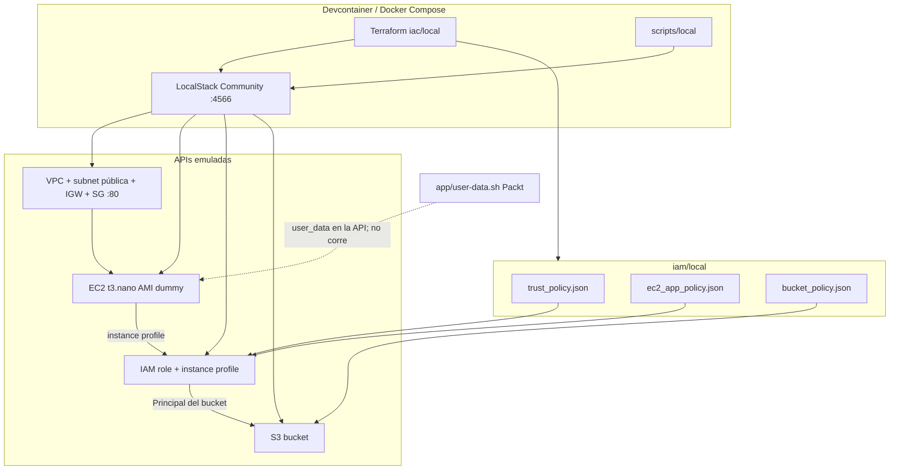

# Arquitectura — poc-cloud-foundation-lab

Etapa documentada: **local** (LocalStack Community). El stack AWS real se describe cuando exista `iac/aws`. Decisiones: [decisions.md](./decisions.md).

## Diagrama

Stack local: el devcontainer habla con LocalStack en `localhost:4566`. Terraform aplica el grafo VPC → EC2 (API) + IAM + S3. Community no bootea la VM; `user-data.sh` viaja en la API y no se ejecuta.

## Componentes

| Componente local | Equivalente cloud | Identidad / credencial |
|---|---|---|
| Devcontainer (Docker-in-Docker, AWS CLI, Terraform) | Workstation / CI | Sin keys reales; `AWS_EC2_METADATA_DISABLED=true` |
| `compose.yaml` → LocalStack `:4566` | Control plane AWS (región `us-east-1` emulada) | `test` / `test` (LocalStack las ignora) |
| `iac/local` Terraform | CloudFormation / Terraform contra la cuenta | Provider con endpoints a LocalStack; state en disco (gitignore) |
| `iam/local/trust_policy.json` | Trust del rol de instancia | Principal `ec2.amazonaws.com` |
| `iam/local` identity + bucket policy | IAM identity policy + S3 resource policy | Rol de instancia; account emulada `000000000000` |
| `aws_instance` en LocalStack | EC2 Amazon Linux 2 | Instance profile; sin access keys en la VM |
| `app/user-data.sh` (referenciado, no ejecutado) | Bootstrap LAMP + phpinfo | N/A en Community |
| Bucket S3 en LocalStack | S3 de config/logs del proyecto | Bucket policy con Principal = rol |
| `scripts/local` | Runbooks / pipeline de apply | Idempotentes; credenciales de entorno dummy |

## Puntos únicos de falla identificados

El sample Packt es deliberadamente frágil (una AZ, un instance, DB en la misma VM). En local el SPOF es de **modelo**, no de runtime: no hay VM ni MariaDB escuchando.

| SPOF | Mitigación en cloud (etapa aws, no ahora) |
|---|---|
| Una AZ (`us-east-1a` emulada) | Subnets en ≥2 AZ |
| Una EC2, sin ASG ni ALB | ASG + load balancer; health checks |
| MariaDB en la misma instancia (user-data Packt) | RDS Multi-AZ; no colocalizar estado en el compute |
| SG `0.0.0.0/0:80` | Restringir origen; TLS; WAF si aplica |
| `phpinfo.php` expuesto | No desplegar info-disclosure; app real detrás de ALB |
| LocalStack como único control plane | No aplica en local; en aws el SPOF pasa a la cuenta/región |
| State Terraform en disco del devcontainer | Backend S3 + lock DynamoDB en etapa aws |

## Decisiones de identidad

- **Servicio a servicio:** la EC2 no lleva access keys. Asume un rol vía instance profile (`iam/local/trust_policy.json`). El bucket solo acepta ese rol (`bucket_policy.json`).
- **Quién puede qué:** identity policy de privilegio mínimo sobre el bucket del proyecto (no `s3:*` global). En Community las condiciones extra (p. ej. `aws:SecureTransport`) pueden ignorarse; se documentan igual como intención para AWS.
- **Credenciales humanas / CLI:** dummy `test`/`test` contra `:4566`. No hay rotación: no son secretos. En aws: OIDC o profile; nunca keys en el repo.
- **Apply:** solo `iac/local` + `scripts/local`. `app/main.tf` (Packt, `eu-west-1` real) no forma parte del camino E2E.

## Alcance de esta etapa

- Sí: API LocalStack (VPC, EC2 mock, IAM, S3), Compose, scripts, tests, doc de costos.
- No: phpinfo en el navegador, RDS, multi-AZ, backend remoto, `iac/aws`.
