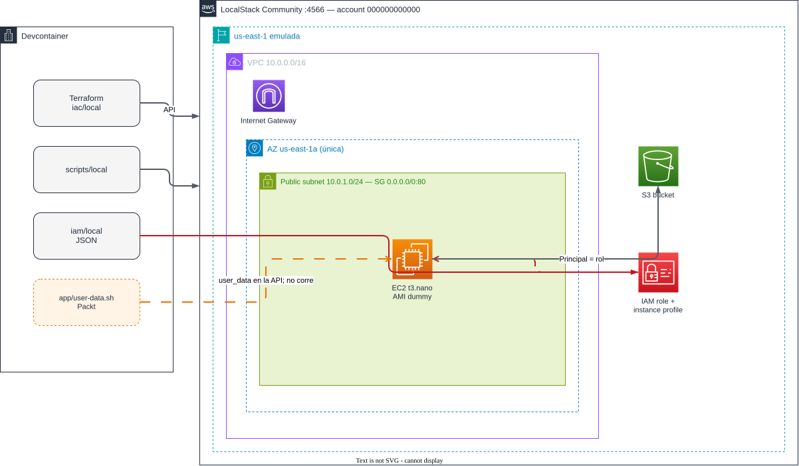
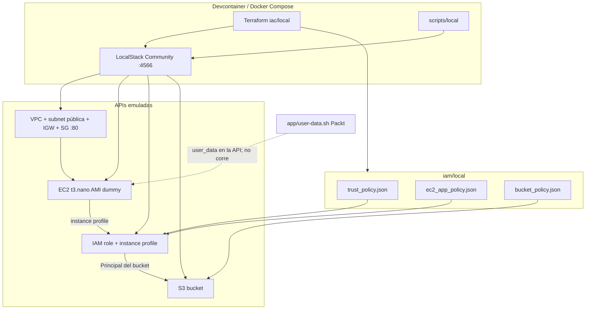
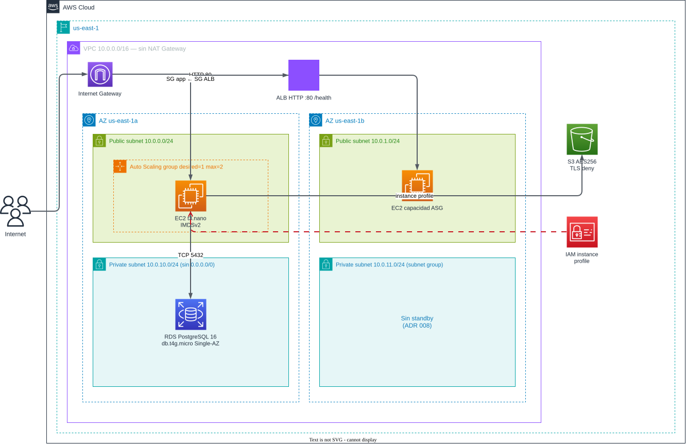
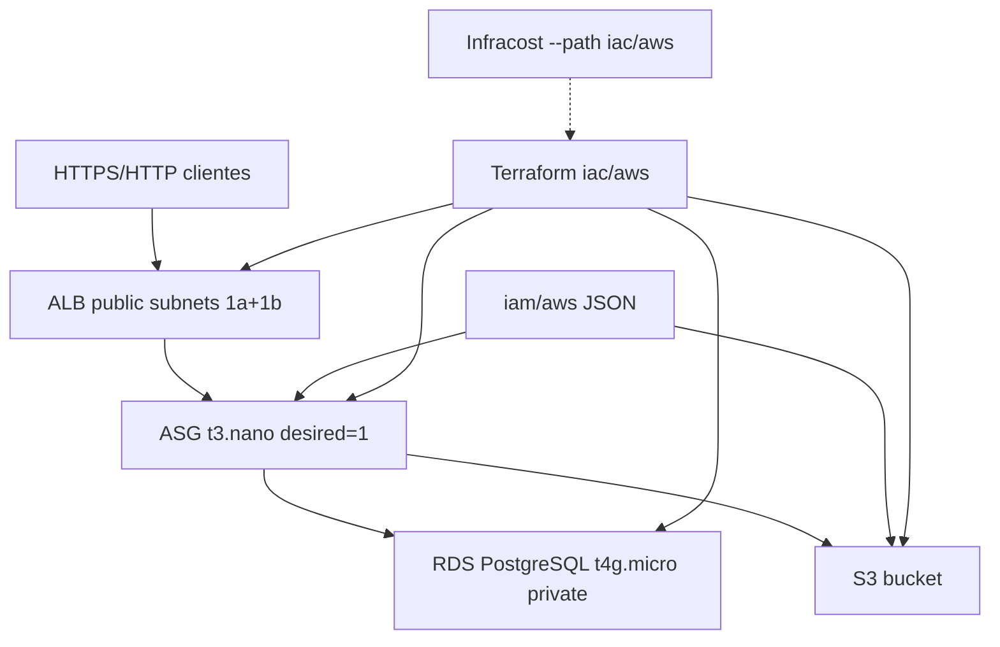

# Arquitectura — poc-cloud-foundation-lab

Dos stacks (ADR 001): **local** (LocalStack Community) y **aws** (`us-east-1`, ADR 006). Decisiones: [decisions.md](./decisions.md). Costos: [costs-local.md](./costs-local.md) · [costs-aws.md](./costs-aws.md). Plan/Gantt AWS: [plan-aws.md](./plan-aws.md). Mejoras (no implementadas): [improvements/](./improvements/). Runbook: [README](../README.md).

---

## Stack local (hecho)

El devcontainer habla con LocalStack en `localhost:4566`. Terraform aplica VPC → EC2 (API) + IAM + S3. Community no bootea la VM; `user-data.sh` viaja en la API y no se ejecuta.

Fuente editable: [diagrams/local.drawio](diagrams/local.drawio) (Draw.io / [diagrams.net](https://app.diagrams.net/)).

Vista lógica:

| Componente local | Equivalente cloud | Identidad / credencial |
|---|---|---|
| Devcontainer | Workstation / CI | Dummy `test`/`test`; `AWS_ENDPOINT_URL=:4566` |
| LocalStack `:4566` | Control plane AWS | Account emulada `000000000000` |
| `iac/local` | Terraform cuenta real | Endpoints LocalStack; state en disco |
| `iam/local` | IAM + bucket policy | Rol de instancia |
| EC2 mock | Amazon Linux | user-data no corre (ADR 004) |

---

## Stack aws

Región `us-east-1`, AZs `a` y `b`. Internet → ALB (subnets públicas) → ASG `t3.nano` (públicas, SG solo desde el ALB) → RDS PostgreSQL privada. S3 vía instance profile. Sin NAT Gateway (ADR 007). Infracost cotiza este HCL, no el local (ADR 011).

Fuente editable: [diagrams/aws.drawio](diagrams/aws.drawio) (Draw.io / [diagrams.net](https://app.diagrams.net/)).

Vista lógica:

| Componente aws | Rol | Identidad / credencial |
|---|---|---|
| Profile `poc-aws` | Apply humano | Named profile; `unset AWS_ENDPOINT_URL` (ADR 009) |
| `iac/aws` | VPC 2 AZ, ALB, ASG, RDS, S3 | Backend S3 + DynamoDB lock |
| `iam/aws` | Trust EC2, policy app, bucket policy | Principal = rol; TLS deny en bucket |
| ALB | Único origen HTTP público | SG del ALB abre 80 (443 si hay cert) |
| ASG t3.nano | Cómputo; user-data sí corre | Instance profile; SG solo desde ALB |
| RDS PostgreSQL | Estado fuera de la EC2 | SG solo desde SG de las instancias |
| Infracost | Estimación pre-apply | `INFRACOST_API_KEY` en el host, no en git |

Criterio de éxito aws: ALB DNS responde (phpinfo o health). Destroy el mismo día (ADR 010).

---

## Puntos únicos de falla

El sample Packt es frágil (1 AZ, 1 instance, DB en la VM). Local solo modela eso. AWS mitiga parte; RDS sigue Single-AZ a propósito (ADR 008).

| SPOF | Local | Mitigación aws |
|---|---|---|
| Una AZ | Modelo emulado | Subnets en 1a y 1b; RDS Single-AZ (Multi-AZ opt-in) |
| Una EC2 | Un `aws_instance` mock | ALB + ASG (desired 1, max 2) |
| DB en el compute | user-data MariaDB (no corre) | RDS PostgreSQL privada |
| SG `0.0.0.0/0:80` en la instancia | Demo local | Solo el SG del ALB llega a las EC2 |
| State en disco | gitignore local | Backend S3 + lock |
| NAT como SPOF/costo | N/A | No hay NAT (ADR 007) |

## Decisiones de identidad

- **Local:** dummy `test`/`test` → `:4566`. Instance profile en la API.
- **AWS:** profile `poc-aws`. Scripts hacen unset de `AWS_ENDPOINT_URL`. La EC2 no lleva keys; asume rol. Bucket policy con Principal=rol y deny sin TLS.
- **Apply Packt `app/`:** prohibido (eu-west-1 real, SG abierto, costo).

## Alcance

| | Local | AWS |
|---|---|---|
| Sí | API LocalStack, Compose, scripts/tests, [costs-local](./costs-local.md) | VPC 2 AZ, ALB+ASG, RDS, Infracost, [costs-aws](./costs-aws.md), destroy el mismo día |
| No | phpinfo real, RDS, NAT | NAT GW, RDS Multi-AZ default, `app/` como apply |
