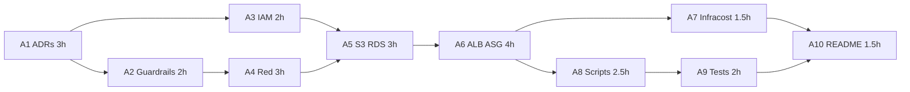
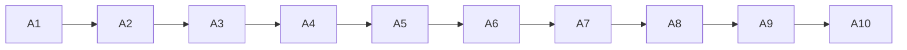

# Plan de implementación — etapa AWS

Esfuerzo **24,5 h** (suma de tareas). Calendario de referencia: 19–25 ago 2026 (fin de semana 22–23 = holgura). Región `us-east-1`. Entregable: [README](../README.md) E2E + [costs-aws.md](./costs-aws.md).

**Paralelo** acá significa *no hay dependencia*: se pueden asignar a otra persona o reordenar. Con **una** persona las horas se suman (24,5 h). Con **dos** frentes, el reloj de pared baja a **21 h**.

## Tareas

| ID | Tarea | h | Depende | Paralelo con |
|---|---|---:|---|---|
| A1 | ADR 006–011 + diagrama en `architecture.md` | 3 | — | — |
| A2 | Guardrails: profile, unset endpoint, backend, Budget | 2 | A1 | **A3** |
| A3 | `iam/aws` trust + policies + bucket policy (TLS deny) | 2 | A1 | **A2** |
| A4 | `iac/aws` red: 2 AZ, públicas/privadas, sin NAT GW | 3 | A2 | — |
| A5 | `iac/aws` datos: S3 + RDS PostgreSQL `db.t4g.micro` | 3 | A3, A4 | — |
| A6 | `iac/aws` cómputo: ALB + ASG `t3.nano` (desired 1) | 4 | A5 | — |
| A7 | Infracost `scan` de `iac/aws` (nunca `iac/local`) | 1.5 | A6 | **A8** |
| A8 | `scripts/aws` 01_creds / 02_apply / 03_verify | 2.5 | A6 | **A7** |
| A9 | `tests/aws` pytest (skip sin credenciales) | 2 | A8 | — |
| A10 | README E2E + `costs-aws.md` (8 h vs 30 d) | 1.5 | A7, A9 | — |

## Camino crítico

```
A1 → A2 → A4 → A5 → A6 → A8 → A9 → A10
3  +  2 +  3 +  3 +  4 + 2.5 + 2 + 1.5  = 21 h
```

A3 se solapa con A2 (después de A1). A7 se solapa con A8 (después de A6). A5 espera a **A3 y A4**; A10 espera a **A7 y A9**.

## Gantt (2 frentes, pared 21 h)

Eje: horas de reloj de pared en el frente crítico. A3 corre con A2; A7 corre con A8.

```
horas     0         3    5         8        11            15      17.5    19.5  21
critico   [ A1 3h  ][A2][ A4 3h  ][ A5 3h ][   A6 4h    ][ A8 2.5][ A9 2h][A10]
paralelo            [A3]                             [A7 1.5]
```



Las ramas A1-A3-A5 y A6-A7-A10 son el trabajo que se puede solapar.

## Gantt (1 persona, 24,5 h)

No hay solapamiento real: A3 va después de A2; A7 va después de A6 y antes de A8.

```
horas  0    3  5  7        10       13           17   18.5      21     23    24.5
serie  [A1  ][A2][A3][ A4 3h ][ A5 3h ][   A6 4h    ][A7 ][ A8 2.5h ][A9 2h][A10]
```



## Calendario de referencia (1 persona)

| Día | IDs | h | Salida |
|---|---|---:|---|
| Mié 19 | A1 | 3 | ADR 006–011; diagrama AWS |
| Jue 20 | A2, A3 | 4 | Bootstrap + Budget; `iam/aws` |
| Vie 21 | A4, A5 | 6 | VPC 2 AZ; S3 + RDS |
| Lun 24 | A6, A7 | 5.5 | ALB+ASG; primer scan Infracost |
| Mar 25 | A8, A9, A10 | 6 | scripts, pytest, README + costs-aws |

Vie 21 suma 6 h (A4+A5) si A3 ya cerró el jueves; ajustar con la holgura del fin de semana.

## Qué no se paraleliza

- A4 no arranca sin A2 (profile/backend).
- A5 no arranca sin red **y** políticas IAM.
- A6 no arranca sin RDS/S3 (SG de app y instance profile).
- A9 no arranca sin `03_verify` (A8).
- A10 no cierra sin Infracost (A7) y tests (A9).
